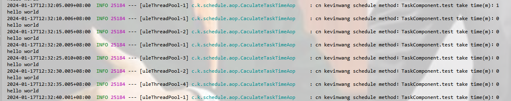

# 分布式定时任务

:a:项目地址：https://github.com/kevinWangSheng/kevinDistributeSchedule-spring-boot-starter

:pig: 我们这里使用springboot3进行自动配置，区别就是原来的META-INF/spring.factory 需要改成 META-INF/spring/org.springframework.boot.autoconfigure.AutoConfiguration.imports文件。然后文件原来是写...AutoConfiguration:对应的类，现在直接写哪个自动装配类的全类名就行。

:dog:我们这个主要是在原有的spring的定时任务@Scheduled之上加一个分布式，并且配置自己的分布式定时任务，基于自己的注解扫描和配置。

:pig:主要基于Spring的@Scheduled注解进行仿照实现定时任务，只不过是加入和一个分布式的实现。

:pencil:我们一般基于注解实现一些功能的时候，必定要去扫描这个注解，然后把对应的配置，应用进行装配和运行等。

:star:我这里是选择了在spring启动的时候进行对应的初始化bean完成之后将对应含有该注解的bean进行扫描，然后装配到对应的内存map中进行初始化的配置

如下，包括初始化地址、扫描任务、注册分布式节点、初始化节点等。

装配任务的时候，我们根据之前初始化放到map中的配置信息，重新封装一个task，按照对应注解获得的cron信息进行配置，就完成了定时任务的配置

:cocktail:但是我们这个是分布式的，所以还需要对于分布式注册中心进行监听，当有心的路径节点改变的时候，应该进行对应的任务扫描、配置和注册等

```java
@Configuration
public class DcsSchedulingConfiguration implements ApplicationContextAware, BeanPostProcessor, ApplicationListener<ContextRefreshedEvent> {
    private final Logger logger = LoggerFactory.getLogger(DcsSchedulingConfiguration.class);
    private final Set<Class<?>> nonAnnotatedClasses = Collections.newSetFromMap(new ConcurrentHashMap<>(64));
    @Override
    public void setApplicationContext(ApplicationContext applicationContext) throws BeansException {
        Constance.Global.applicationContext = applicationContext;
    }

    // 当bean初始化完成之后，需要将对应的定时任务执行的类装载到内存中，这里用一个map存储，方便后面的调用
    @Override
    public Object postProcessAfterInitialization(Object bean, String beanName) throws BeansException {
        // 获取他对应的最终代理执行类
        Class<?> targetClass = AopProxyUtils.ultimateTargetClass(bean);
        if(nonAnnotatedClasses.contains(targetClass)) return bean;
        // 通过反射获取对应的方法
        Method[] declaredMethods = ReflectionUtils.getDeclaredMethods(targetClass);
        if(declaredMethods == null || declaredMethods.length == 0) return bean;
        // 将要执行的任务对象存储到的目标map中
        List<ExecOrder> execOrders = Constance.execOrderMap.computeIfAbsent(beanName, k -> new ArrayList<>());
        // 这个set用来防止重复添加对应的定时任务
        nonAnnotatedClasses.add(targetClass);
        // 抽取出每一个方法，将它转换成为一个执行任务对象
        for(Method method:declaredMethods){
            DcsSchedule dcsSchedule = AnnotationUtils.findAnnotation(method, DcsSchedule.class);
            if(null == dcsSchedule) continue;
            // 将对应的任务进行转化
            ExecOrder execOrder = new ExecOrder();
            execOrder.setBean(bean);
            execOrder.setBeanName(beanName);
            execOrder.setCorn(dcsSchedule.corn());
            execOrder.setDesc(dcsSchedule.desc());
            execOrder.setAutoStatus(dcsSchedule.autoStartup());
            execOrder.setMethodName(method.getName());
            execOrders.add(execOrder);
        }
        return bean;
    }

    @Override
    public void onApplicationEvent(ContextRefreshedEvent event) {
        try {
            ApplicationContext applicationContext = event.getApplicationContext();
            // 1. 初始化配置
            initConfig(applicationContext);
            // 2. 初始化服务
            initServer(applicationContext);
            // 3. 启动任务
            initTask(applicationContext);
            // 4. 挂载节点
            initNode();
            // 5. 心跳监听
            HeartbeatService.getInstance().startFlushScheduleStatus();
            logger.info("cn kevinwang init the schedule config、 server、 task、 node、 heartbeat success!");
        } catch (Exception e) {
            throw new RuntimeException(e);
        }
    }

    private void initConfig(ApplicationContext context){
        try {
            StarterServerProperties properties = context.getBean(Constance.BeanName.StarterServerAutoConfigBeanName, StarterServerAutoConfig.class).getProperties();
            Constance.Global.zkAddress = properties.getZkAddress();
            Constance.Global.scheduleServerId = properties.getScheduleServerId();
            Constance.Global.scheduleServerName = properties.getScheduleServerName();
            InetAddress localHost = InetAddress.getLocalHost();
            Constance.Global.ip = localHost.getHostAddress();
        } catch (UnknownHostException e) {
            logger.error("cn kevinwang init the schedule config error!", e);
            throw new RuntimeException(e);
        }
    }

    public void initServer(ApplicationContext context){
        try {
            CuratorFramework client = ZkCuratorService.getClient(Constance.Global.zkAddress);
            Constance.Global.path_root_server = StringUtil.join(Constance.Global.path_root, LINE, "server", LINE, Constance.Global.scheduleServerId);
            path_root_server_ip = StringUtil.join(Constance.Global.path_root_server, LINE, "ip", LINE, Constance.Global.ip);
            // 递归删除ip下的旧内容
            ZkCuratorService.deletingChildrenIfNeeded(client, path_root_server_ip);
            // 删除之后重新创建
            ZkCuratorService.createNode(client, path_root_server_ip);
            // 然后在设置对应的数据
            ZkCuratorService.setData(client, Constance.Global.path_root_server, Constance.Global.scheduleServerName);

            // 添加节点的同时进行监听
            ZkCuratorService.createNodeSimple(client,Constance.Global.path_root_exec);
            ZkCuratorService.addTreeCacheListener(context,client,Constance.Global.path_root_exec);
        } catch (Exception e) {
            logger.error("cn kevinwang init the schedule server error!", e);
        }
    }

    // 对所有需要运行的任务进行启动
    public void initTask(ApplicationContext context){
        CronTaskRegister cronTaskRegister = context.getBean(Constance.BeanName.CronTaskRegisterBeanName, CronTaskRegister.class);
        Set<String> beanNames = Constance.execOrderMap.keySet();
        for(String beanName:beanNames){
            List<ExecOrder> execOrders = Constance.execOrderMap.get(beanName);
            for(ExecOrder execOrder:execOrders){
                // 对其判断是否需要启动
                if(!context.containsBean(execOrder.getBeanName())) continue;
                Object bean = context.getBean(execOrder.getBeanName());
                if(execOrder.getAutoStatus()){
                    cronTaskRegister.addTask(new SchedulingRunnable(bean,execOrder.getBeanName(),execOrder.getMethodName()),execOrder.getCorn());
                }
            }
        }
    }

    //4. 挂载节点
    private void initNode() throws Exception {
        Set<String> beanNames = Constance.execOrderMap.keySet();
        for (String beanName : beanNames) {
            List<ExecOrder> execOrderList = Constance.execOrderMap.get(beanName);
            for (ExecOrder execOrder : execOrderList) {
                String path_root_server_ip_clazz = StringUtil.join(path_root_server_ip, LINE, "clazz", LINE, execOrder.getBeanName());
                String path_root_server_ip_clazz_method = StringUtil.join(path_root_server_ip_clazz, LINE, "method", LINE, execOrder.getMethodName());
                String path_root_server_ip_clazz_method_status = StringUtil.join(path_root_server_ip_clazz, LINE, "method", LINE, execOrder.getMethodName(), "/status");
                //添加节点
                ZkCuratorService.createNodeSimple(client, path_root_server_ip_clazz);
                ZkCuratorService.createNodeSimple(client, path_root_server_ip_clazz_method);
                ZkCuratorService.createNodeSimple(client, path_root_server_ip_clazz_method_status);
                //添加节点数据[临时]
                ZkCuratorService.appendPersistentData(client, path_root_server_ip_clazz_method + "/value", JSON.toJSONString(execOrder));
                //添加节点数据[永久]
                ZkCuratorService.setData(client, path_root_server_ip_clazz_method_status, execOrder.getAutoStatus() ? "1" : "0");
            }
        }
    }
}

```

监听注册中心节点

```java
public void startFlushScheduleStatus() {
        ses = Executors.newScheduledThreadPool(1);
        //300秒后，每60秒心跳一次
        ses.scheduleAtFixedRate(() -> {
            try {
                logger.info("itstack middleware schedule heart beat On-Site Inspection task");
                Map<String, ScheduledTask> scheduledTasks = Constance.scheduledTasks;
                Map<String, List<ExecOrder>> execOrderMap = Constance.execOrderMap;
                Set<String> beanNameSet = execOrderMap.keySet();
                for (String beanName : beanNameSet) {
                    List<ExecOrder> execOrderList = execOrderMap.get(beanName);
                    for (ExecOrder execOrder : execOrderList) {
                        String taskId = execOrder.getBeanName() + "_" + execOrder.getMethodName();
                        ScheduledTask scheduledTask = scheduledTasks.get(taskId);
                        if (null == scheduledTask) continue;
                        boolean cancelled = scheduledTask.isCanceled();
                        // 路径拼装
                        String path_root_server_ip_clazz = StringUtil.join(path_root_server_ip, LINE, "clazz", LINE, execOrder.getBeanName());
                        String path_root_server_ip_clazz_method = StringUtil.join(path_root_server_ip_clazz, LINE, "method", LINE, execOrder.getMethodName(), LINE, "value");
                        // 获取现有值
                        ExecOrder oldExecOrder;
                        byte[] bytes = client.getData().forPath(path_root_server_ip_clazz_method);
                        if (null != bytes) {
                            String oldJson = new String(bytes, charset);
                            oldExecOrder = JSON.parseObject(oldJson, ExecOrder.class);
                        } else {
                            oldExecOrder = new ExecOrder();
                            oldExecOrder.setBeanName(execOrder.getBeanName());
                            oldExecOrder.setMethodName(execOrder.getMethodName());
                            oldExecOrder.setDesc(execOrder.getDesc());
                            oldExecOrder.setCorn(execOrder.getCorn());
                            oldExecOrder.setAutoStatus(execOrder.getAutoStatus());
                        }
                        oldExecOrder.setAutoStatus(!cancelled);
                        //临时节点[数据]
                        if (null == Constance.Global.client.checkExists().forPath(path_root_server_ip_clazz_method))
                            continue;
                        String newJson = JSON.toJSONString(oldExecOrder);
                        Constance.Global.client.setData().forPath(path_root_server_ip_clazz_method, newJson.getBytes(charset));
                        //永久节点[数据]
                        String path_root_ip_server_clazz_method_status = StringUtil.join(path_root_server_ip_clazz, LINE, "method", LINE, execOrder.getMethodName(), "/status");
                        if (null == Constance.Global.client.checkExists().forPath(path_root_ip_server_clazz_method_status))
                            continue;
                        Constance.Global.client.setData().forPath(path_root_ip_server_clazz_method_status, (execOrder.getAutoStatus() ? "1" : "0").getBytes(charset));
                    }
                }
            } catch (Exception ignore) {
            }

        }, 300, 60, TimeUnit.SECONDS);
    }
```

还有这里需要对这些配置进行装配，我们使用了自定义的注解，仿照@EnableSchedule，进行声明对应的配置

`在编写对应的配置的时候注意你编写的配置是否注册到了spring的容器中。`

```java
@Target(ElementType.TYPE)
@Retention(RetentionPolicy.RUNTIME)
@Import({DcsSchedulingConfiguration.class})
@ImportAutoConfiguration({SchedulingConfig.class, CaculateTaskTimeAop.class, CronTaskRegister.class})
@ComponentScan("cn.kevinwang.schedule.*")
public @interface EnableDcsSchedule {
}
```

这样在spring启动的时候就会自动给这些配置进行对应配置了。

最后对应的测试：

```java
@Component
public class TaskComponent {
    @DcsSchedule(corn = "0/5 * * * * ?",desc = "测试定时任务",autoStartup = true)
    public void test(){
        System.out.println("hello world");
    }
}

```

