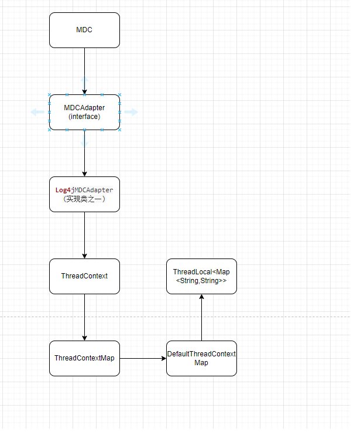
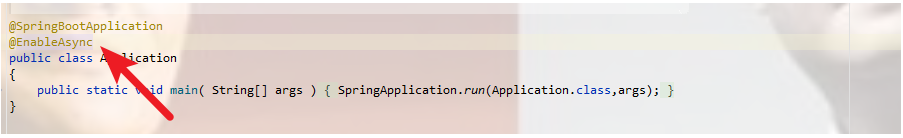
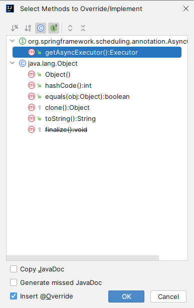

# 基于slf4j实现追踪链路id

排查问题是程序员的基本能力也是必须要会的，在开发环境，我们可以debug,但是一旦到了服务器上，就很难debug了，最有效的方式就是通过日志揪出bug，而一次请求的日志如果没有一个唯一的链路标识（我们下边称他为traceId）,单靠程序员人工分析的话，费时费力，尤其是请求量高频的接口，更是雪上加霜，排查问题效率大打折扣，作为程序员，低效的方式是忍不了的！！！ 本文我将用一次实战演练，来演示常用框架/中间件/多服务 之间如何传递traceId

## 主要内容

- 链路追踪简述和自实现思路
- 单服务内如何实现链路id的输出
- 如何解决@Async异步调用的时候出现的主线程和子线程追踪链路不一样
- 使用MQ中间件等时候如何解决链路id不一样的问题

因为在涉及到分布式的项目中，你调用一个服务的时候可能只能debug你自己能够管理的一部分服务，并且在线上出现问题的时候，你是不能够进行debug的，这个时候如果一行一行从头进行分析，这个效率就会特别慢，所以凭借着日志进行定位解决问题能够提高解决问题的效率，并且只要一般涉及到网关的调用，一般都需要做链路追踪。

我们这里使用log4j的slf4j的MDC进行实现链路追踪

先简单介绍一下MDC:

`映射诊断上下文（Mapped Diagnostic Context，简称MDC）是一种工具，用于区分不同来源的交错日志输出。当服务器几乎同时处理多个客户机时，日志输出通常是交错的。 MDC是基于每个线程进行管理的 。`

从底层来看的话就是：


所以他的put get remove clear都是基于底层的ThreadLocal进行的操作，所以这里是基于每一个线程id进行对应的管理的。

首先我们先来看一下单台服务器的实现

首先实现一下日志打印配置文件：

```xml
<!-- Logback configuration. See http://logback.qos.ch/manual/index.html -->
<configuration scan="true" scanPeriod="10 seconds">
    <!--设置重要-->
    <property name="CONSOLE_LOG_PATTERN"
              value="%highlight(%date{yyyy-MM-dd HH:mm:ss}) | %highlight(%-5level) | %highlight(%thread) | %highlight(%logger) [traceId:%X{traceId}] | %msg%n"/>

    <appender name="CONSOLE" class="ch.qos.logback.core.ConsoleAppender">
        <encoder charset="UTF-8">
            <pattern>${CONSOLE_LOG_PATTERN}</pattern>
        </encoder>
    </appender>

    <!-- 定义错误日志的文件输出器 -->
    <appender name="FILE-ERROR" class="ch.qos.logback.core.FileAppender">
        <file>error.log</file> <!-- 错误日志文件的名称和位置 -->
        <encoder>
            <pattern>%d{yyyy-MM-dd HH:mm:ss.SSS} [%thread] %-5level %logger{36} - %msg %X{traceId}%n</pattern>
        </encoder>
        <filter class="ch.qos.logback.classic.filter.LevelFilter">
            <level>ERROR</level>
            <onMatch>ACCEPT</onMatch>
            <onMismatch>DENY</onMismatch>
        </filter>
    </appender>

    <root level="INFO">
        <appender-ref ref="CONSOLE"/>
    </root>
</configuration>
```

然后在对应的application.yml中配置该日志路径

```yml
logging:
  config: classpath:logback-spring.xml
```

基础的工具类，设置traceId

```java
public class TraceIdUtil {
    public static String setTraceId(String traceId){
        if(StringUtils.isNotBlank(traceId)){
            MDC.put(Constance.TRACE_ID,traceId);
        }else{
            return generateTraceId();
        }
        return traceId;
    }

    public static String generateTraceId(){
        String traceId = IdUtil.simpleUUID();
        MDC.put(Constance.TRACE_ID,traceId);
        return traceId;
    }

    public static void removeTraceId(){
        MDC.remove(Constance.TRACE_ID);
    }

    public static String getTraceId() {
        return MDC.get(Constance.TRACE_ID);
    }
}
```

接下来我们需要对每一个请求进来的时候设置一下对应该请求的traceId，所以我们需要实现一下过滤器适配器，以及配置过滤器

首先实现适配器，实现HandlerInterceptor

```java
public class TraceIdInterceptor implements HandlerInterceptor {
    private final Logger logger = LoggerFactory.getLogger(TraceIdInterceptor.class);
    @Override
    public boolean preHandle(HttpServletRequest request, HttpServletResponse response, Object handler) throws Exception {
        String traceId = TraceIdUtil.generateTraceId();
        logger.info("");
        return true;
    }
	// 记得在请求结束之后对该TraceId进行删除，因为底层使用的是ThreadLocal，如果不删除可能会出现内存泄露
    @Override
    public void afterCompletion(HttpServletRequest request, HttpServletResponse response, Object handler, Exception ex) throws Exception {
        TraceIdUtil.removeTraceId();
    }
}
```

然后在将该interceptor加入到过滤器中，实现WebMvcConfigure

```java
@Configuration
public class WebMvcConfig implements WebMvcConfigurer {
    @Override
    public void addInterceptors(InterceptorRegistry registry) {
        registry.addInterceptor(new TraceIdInterceptor());
    }
}
```

接着随便编写一个请求，然后在日志log.info()一下就行

```java
@GetMapping("helloworld")
public Result helloworld(){
    traceService.sayHelloWorld();
    return Result.success(TraceIdUtil.getTraceId());
}
```

结果输入如下


## 解决异步问题

按照上面我们随便编写一个服务，然后进行异步调用，比如使用@Async


```java
@Service
public class TraceServiceImpl implements TraceService {
    private final Logger logger = LoggerFactory.getLogger(TraceServiceImpl.class);
    @Async
    @Override
    public void sayHelloWorld() {
        logger.info("hello world");
    }
}
```

就会发现这个由主线程创建的异步子线程的traceId为空：


这个是因为主线程在创建子线程的时候，上下文中的值没有传递过去，我们所要解决的就是在这个线程创建执行的时候顺便把主线程的traceId塞到子线程中

我们这里使用的是代理模式

主要要解决的就是这个@Async在配置的时候使用我们自己自定义配置的Thread

所以我们要解决的是实现这个：AsyncConfigurer

如下：


可以看到这里他需要返回一个Executor，所以我们可以设置自己的ThreadFactory

如下

```java
@Configuration
@EnableAsync
public class CustomAsyncConfigure implements AsyncConfigurer {
    @Override
    public Executor getAsyncExecutor() {
        ThreadPoolTaskExecutor executor = new ThreadPoolTaskExecutor();
        executor.setCorePoolSize(5);
        executor.setMaxPoolSize(10);
        executor.setQueueCapacity(20);
        executor.setThreadFactory(new TraceThreadFactory());
        executor.initialize();
        return executor;
    }

    @Override
    public AsyncUncaughtExceptionHandler getAsyncUncaughtExceptionHandler() {
        return new SimpleAsyncUncaughtExceptionHandler();
    }
}
```

我们实现的ThreadFactory主要在创建线程的时候首先应该是把主线程的traceId设置到子线程中

```java
public class TraceThreadFactory implements ThreadFactory {
    private final ThreadFactory delegateThreadFactory = Executors.defaultThreadFactory();
    @Override
    public Thread newThread(Runnable task) {
        return delegateThreadFactory.newThread(new TraceRunnable(TraceIdUtil.getTraceId(),task));
    }
}
```

最终的代理线程

```java
public class TraceRunnable implements Runnable{
    private String traceId;

    // 使用代理模式，来完成调用
    private Runnable deleteate;

    public TraceRunnable(String traceId, Runnable deleteate) {
        this.traceId = traceId;
        this.deleteate = deleteate;
    }

    @Override
    public void run() {
        try {
            MDC.put(Constance.TRACE_ID,traceId);
            deleteate.run();
        } catch (IllegalArgumentException e) {
            MDC.remove(Constance.TRACE_ID);
        }
    }
}
```

我们在启动线程的时候先设置一下对应的traceId，然后在执行代理调用的部分

最终结果如下：结果一样了


## 处理消息MQ

在发送MQ的时候，因为发送消息他设计Channel的发送，所以是不同线程的，这里我们需要在他发送前后进行处理

这里在发送消息之前，他会调用MessagePostProcessor的postMessage方法，所以我们在这里进行实现一下，然后在配置类RabbitTemplate配置的时候进行设置就行：

```java
public class RabbitTraceMessageBeforePost implements MessagePostProcessor {
    @Override
    public Message postProcessMessage(Message message) throws AmqpException {
        return message;
    }

    @Override
    public Message postProcessMessage(Message message, Correlation correlation, String exchange, String routingKey) {
        String traceId = TraceIdUtil.getTraceId();
        if(StringUtils.isBlank(traceId)){
            traceId = TraceIdUtil.generateTraceId();
        }
        message.getMessageProperties().setHeader(Constance.RabbitConstance.RABBIT_TRACE_ID,traceId);
        return message;
    }
}
```

配置如下

```java
	@Bean
    public RabbitTemplate rabbitTemplate(RabbitTemplateConfigurer configurer, ConnectionFactory connectionFactory){
        RabbitTemplate template = new RabbitTemplate();
        configurer.configure(template,connectionFactory);

        template.setBeforePublishPostProcessors(new RabbitTraceMessageBeforePost());
        return template;
    }
```

这里我们在处理消息的时候使用aop进行设置。我们这里执行消息处理用的注解是RabbitListener，参数是message，是通过message.getBody()拿到内容以后在反序列化的，所以这里的注解是Message

```java
@Aspect
@Component
public class MessageProcessingAspect {
    @Around("@annotation(rabbitListener)")
    public Object aroundMessageHandling(ProceedingJoinPoint joinPoint, RabbitListener rabbitListener) throws Throwable {
        try {
            Object[] args = joinPoint.getArgs();
            for(Object arg : args){
                // 判断发送的消息，然后获取对应的traceId进行设置
                if(arg instanceof Message){
                    String traceId = ((Message) arg).getMessageProperties().getHeader(Constance.RabbitConstance.RABBIT_TRACE_ID);
                    TraceIdUtil.setTraceId(traceId);
                }
            }
            return joinPoint.proceed();
        }catch (Exception e){
            throw new RuntimeException(e);
        }finally {
            // 在消息处理之后清除 TraceId
            TraceIdUtil.removeTraceId();
        }
    }
}

```

