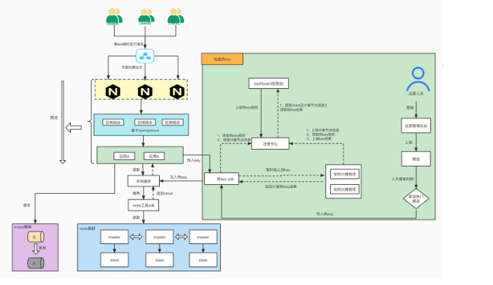
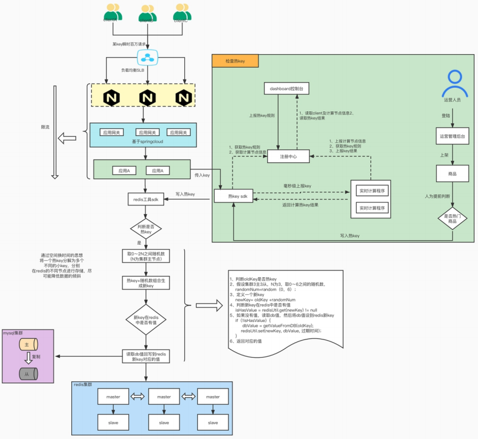

# Redis热key
## 什么是热key
在 Redis 中，热 key是指那些在极短的时间内访问频次非常高的key。
## 出现场景
一般对于一些多个用户短时间内一起点击的东西，比如一个爆款，短时间内大量用户都会查看这个东西，如果你使用到了
redis，那么这个对应的key就会在redis中是一个热key。或者是一些其他的爬虫，过来调用你的接口，反正急速短时间内访问大量访问这个key的，这个key就是一个热key

## 影响
1. 首先，短时间内大量请求访问这个key，对应的redis节点就会被打满，可能会出现丢包现象，而我们知道在网络传输中，使用TCP进行传输，如果丢包了，那么他会重发
，但是重发的话，他会耗费更多的时间，这样请求一多，他势必会产生阻塞，接口的响应速度就会变慢，会导致阻塞等问题。
2. 请求过多，热点key引起redis节点数据倾斜，缓存服务被打垮
3. 还有就是大量的请求会穿透redis，直接打到DB上，我们知道db一般能抗的流量非常有限，所以可能会打垮db

## 检测
那么我们如何发现对应的热key呢？

自己开发一些第三方SDK进行检测等。检测完成之后直接接入你自己的业务系统。

或者在redis4.0以后使用命令进行检测： redis-cli --hotkeys ，但由于
需要扫描整个 keyspace，实时性上比较差，另外扫描耗时与 key 的数量正相关，如果 key
的数量比较多，耗时可能会非常长。 

你也可以进行抓包，抓取某一段时间内的TCP dump的流量，然后进行上报。

## 解决
### 本地缓存
第一种方案是使用本地缓存进行，相当于多加一个一级缓存。 当你发现对应的热key的时候，直接将他放到本地缓存中就行，但是我们现在的系统是分布式的情况，还需要对于各个分布式节点进行对应的数据一致性操作。
因为对于本地缓存来说，他的速度是非常快的，并且能够抗住大量请求的同时发送过来。所以使用相当于一个二级缓存是一个不错的选择。
具体的架构如下：

具体情况就是请求过来以后进行对应的扫描热key，然后将对应的热key上报到注册中心，这里可以使用一个netty进行对应的连接，然后一个客户端在从注册中心获取对应的热key，在将它放到对应的本地缓存中，大致流程就是这么一个过程。

### 分流
通过空间换时间的思想，将一个热key分解为多个不同的小key，分别在redis集群的不同
节点进行存储，尽可能降低数据的倾斜，当瞬间有几十万的请求去访问redis上某个key，
通过key分流，请求会分散打到不同的节点获取数据，这样就没有所谓的热点key问题。 

具体如下：

### 限流
另一种方法是直接进行限流，这个是在应用方面做阻塞了
一般有一些常见的算法，令牌桶、滑动窗口等
还有一些具体的api，比如Ratelimiter、hystrix等。
