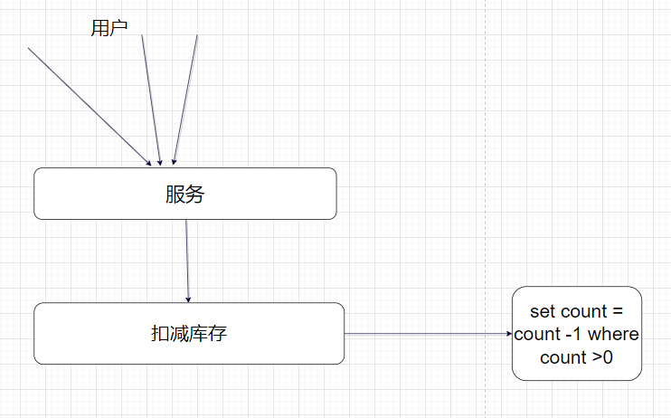
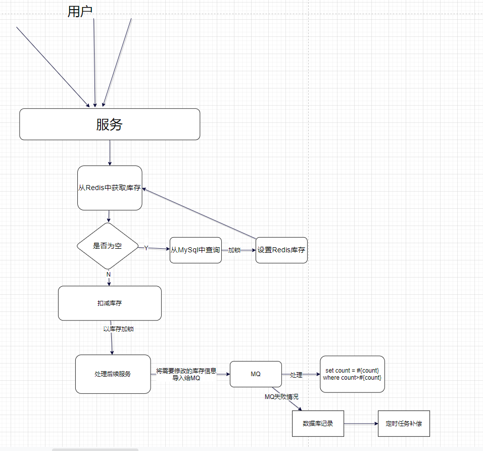

# 涉及数据库库存删减

我们在涉及数据库库存的扣减方面，一般的老传统处理方式都是 set count = count -1 where count>0

这个在对于并发量不高的情况下完全能够应对，但是如果流量大一点，MySql可能就处理不了了，因为数据库的资源是非常宝贵的，根据能量守恒定律，你处理了这个地方，其他地方就没法处理，所以我们必须将其抽离处理。

这里我们一般使用redis+MQ进行配合，因为流量可能比较大，所以可能会存在多个同时获取，所以需要配合上redis，MQ呢主要是做解耦处理的。

redis嘛，就是记录库存的同时对对应的库存进行粒度比较细的加锁，防止多个人共同使用一个东西。只不过这里由传统的会话锁变成了分布式锁。

比如下面这个扣减库存的流程

数据库有一个对应的表，表中记录了对应的库存，每次成功获取一次都需要减少一次库存。


下面就是一个基础的流程


这里我们在将它进行改进一下，引入Redis分担他的修改压力

将其进行对应的改造


这里引入了redis以后，获取库存第一次是为null的，但是因为可能存在多个用户获取，需要进行加锁，同时需要进行二次校验，因为第一次获取为null，然后你从数据库中查询的这段时间可能其他线程也进来了，这个时候也可能为空，他又从数据库里面拿，数据库没有改变，两个就冲突了

所以基本代码如下：

```java
		// 从缓存中获取库存
        Object stockCountObj =  redisUtils.get(Constance.RedisKey.KEY_YOUR_ENTITY_STOCK_COUNT(req.getEntityId()));
        // 数据库获取库存操作
        YourEntity entity = entityMapper.queryById(req.getEntityId());
        // 这里可能会出现多个线程争抢的情况，需要进行二次获取,同时需要判断是否已经抢完了，通过redis的库存和总数进行比较判断是否抢完
        if(null == stockCountObj){
            stockCountObj = redisUtils.get(Constance.RedisKey.KEY_LOTTERY_ACTIVITY_STOCK_COUNT(req.getActivityId()));
        }
		// 这里只有第一次判断比较繁琐，后面的进来不需要进入下面这个加锁设置了
		if(stockCountObj == null){
            // 如果对应的分布式没有设置过需要设置一下，并且在获得锁之后还需要在判断一下有没有设置，如果设置了就不需要在设置了,这里进行了一个双重校验
            redisUtils.setNx(Constance.RedisKey.KEY_YOUR_ENTITY_STOCK_COUNT(req.getEntityId()),1000l);
            if(!redisUtils.hasKey(Constance.RedisKey.KEY_YOUR_ENTITY_STOCK_COUNT(req.getEntityId()))) {
                redisUtils.set(Constance.RedisKey.KEY_YOUR_ENTITY_STOCK_COUNT(req.getEntityId()), entity.getStockCount());
            }
            redisUtils.del(Constance.RedisKey.KEY_YOUR_ENTITY_STOCK_COUNT(req.getEntityId()));
        }
```

这里就简单处理了一下redis设置库存的

下面这个是redis设置细粒度锁的，主要是使用对应的流程业务表的Key+库存

```java
// 先获取对应库存的key
        String entityStockCountKey = Constance.RedisKey.KEY_YOUR_ENTITY_STOCK_COUNT(entityId);

        // 超出秒杀库存范围，直接返回
        Integer redisRtockCount = (int)redisUtils.incr(entityStockCountKey,1);
        if(redisRtockCount>stockCount){
            redisUtils.decr(entityStockCountKey,1);
            // 返回失败
            return new StockResult(Constance.ResponseCode.OUT_OF_STOCK.getCode(),Constance.ResponseCode.OUT_OF_STOCK.getDesc());
        }
		// 这里使用对应的业务表Key+库存形成粒度更细的锁，进行对应的加锁
        String redisLockKey = Constance.RedisKey.KEY_YOUR_ENTITY_STOCK_COUNT(entityId,redisStockCount);
        boolean lockSuccess = redisUtils.setNx(redisLockKey,350L);
        if(!lockSuccess){
            logger.info("抽奖活动{}用户秒杀{}扣减库存，分布式锁失败：{}", activityId, uId, redisLockKey);
            return new StockResult(Constance.ResponseCode.ERR_TOKEN.getCode(),Constance.ResponseCode.ERR_TOKEN.getDesc());
        }
```

同样加锁成功以后就进行处理这个流程，根据他的信心处理下面的流程，同时还要对其中的过程做校验，如果失败了记得释放锁

```java
if(Constance.ResponseCode.SUCCESSFUL.getCode() != result.getCode()){
    // 如果获取锁失败，可能是库存不够，或者加锁失败等，或者其他意外，都需要释放刚才加的锁
    this.recoverCacheStockByRedis(req.getEntityId(),stockResult.getStockKey(),stockResult.getCode());
    return new StockResult(stockResult.getCode(),stockResult.getInfo()); // 返回，信息，该装填信息装填，返回失败的信息
}
```

最后处理完整体流程以后在释放一下锁就行

```java
recoverCacheStockByRedis(req.getEntityId(),stockResult.getStockKey(),stockResult.getCode());
```

最主要应该考虑多线程在执行其他操作的时候是否会产生其他影响，比如进行MySQL查询的时候，速度较慢，在这期间如果请求多的话，没注意可能就会产生影响。

这是我处理的一个大致思路，细节的东西根据具体情况考虑讨论，查查资料都能解决，不是什么大问题。

如果有错误，欢迎指出。

